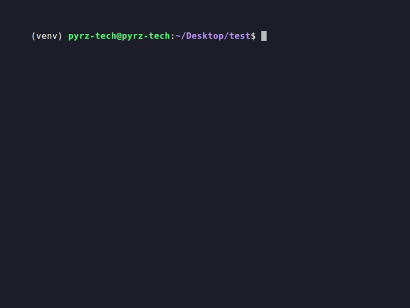

<p align="center">
  
</p>

<h1 align="center">Warehouse CLI</h1>

<p align="center">
  <strong>Plugin-based warehouse management CLI with Clean Architecture</strong>
</p>

<p align="center">
  <a href="https://pypi.org/project/warehouse-cli/">
    
  </a>
  
</p>

---

## Features
- Clean Architecture (Domain, Infrastructure)
- Factory Pattern + `@register` plugin system
- `pydantic` + `Protocol` for type-safe validation
- Beautiful UX with `rich` + `click`
- test coverage with `unittest`

## Installation
```bash
pip install warehouse-cli
